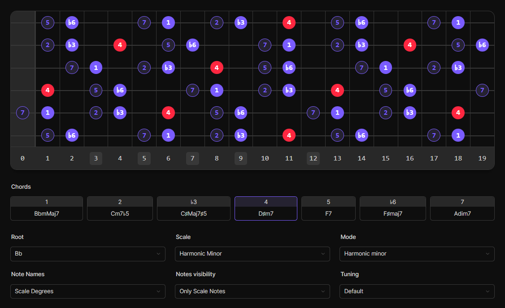

# 🎸 guitar-scales

Visualize your guitar scales, find voicings and learn the intervals!

Check it out here: https://harmendv.github.io/guitar-scales/

### Example

## Features

### Supported scales
- Major (Ionian)
- Major Pentatonic
- Minor Pentatonic
- Major Blues
- Minor Blues
- Natural Minor (Aeolian)
- Harmonic Minor
- Dorian

### Show intervals
Only highlight certain intervals to easily find new voicings.

## Todo
- Add all modes
- Better interval notation
